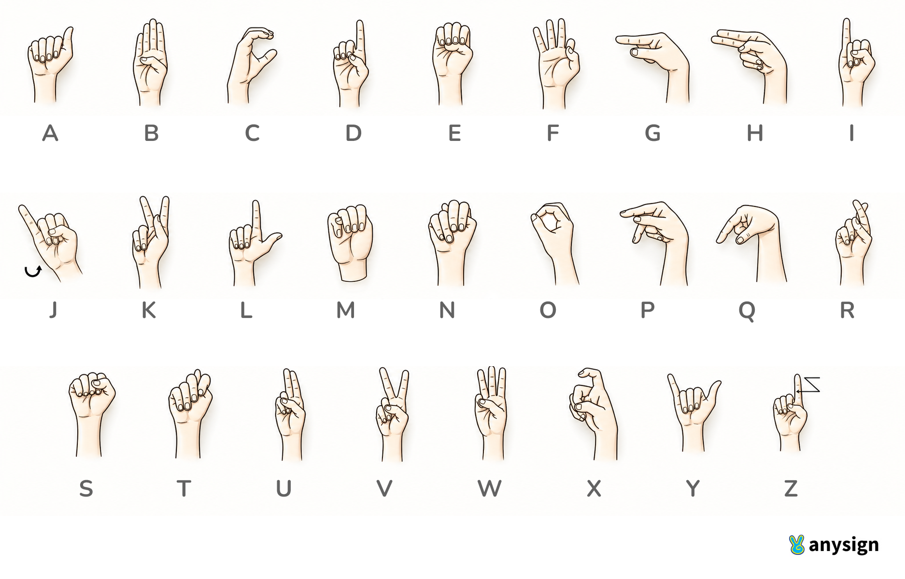

# 🤟 Real-Time ASL Alphabet Recognition
## Landmark-Based Gesture-to-Text Pipeline with Live Webcam Inference


---

## 📌 Project Overview

This project implements a **Real-Time American Sign Language (ASL) Alphabet Recognition system** that converts hand gestures (A–Z) into text live from a webcam feed. The pipeline uses **MediaPipe** for 21-point hand landmark extraction, a **1D-CNN** (TensorFlow/Keras) and an **MLP** (scikit-learn) for letter classification, and **OpenCV** for the live video loop. A standalone `webcam_recognition.py` script handles the full real-time inference loop with debounce logic, sentence building, and optional **text-to-speech** output via `pyttsx3`.

A key design choice is using **landmark coordinates rather than raw images** as the model input — 63 numbers per frame instead of a full image — giving the system far lower latency, zero background/lighting bias, and strong generalisation to any camera position, all without sacrificing accuracy.

🎥 **Project Demo Video:** [▶ Demonstration](https://drive.google.com/file/d/1FQnC7exExjymAOGzNtas4dKlSxX7wEJu/view?usp=sharing)

> 🏢 **Internship Project-2** | Elevate Labs AI/ML Program

---

## ✨ Features

- 🖐️ **MediaPipe Hand Landmark Extraction** — 21 `(x, y, z)` keypoints detected per frame using MediaPipe's Tasks API in VIDEO mode, with a dedicated `hand_landmarker.task` model
- 🔢 **Position & Scale Normalisation** — every landmark array is re-centered on the wrist (landmark 0) and rescaled by the maximum joint distance, making predictions invariant to where in the frame the hand appears and how large it is; this fixes a data-quality bug in the original dataset where only Z was truly position-invariant
- 🧠 **Dual Model Architecture** — a 1D-CNN (`asl_cnn_model.keras`) trained with Gaussian jitter and in-plane rotation augmentation for robustness, plus a scikit-learn MLP quickstart (`asl_landmark_model.pkl`) that trains in seconds without TensorFlow or a GPU
- ✅ **99.8% Test Accuracy** — achieved by the MLP on a stratified 80/20 split of 10,508 samples across 26 classes; only 3 misclassifications in the entire test set
- 📝 **LetterStabilizer + SentenceBuilder** — debounce logic that requires a sign to be held for `hold_frames` consecutive frames above a confidence threshold before committing; handles double letters (e.g. the LL in HELLO), auto-space on hand removal, and backspace/clear/speak keyboard controls
- 🔊 **Text-to-Speech Output** — optional `pyttsx3` integration reads the accumulated sentence aloud at ~150 wpm, running on a daemon thread to avoid blocking the video loop
- 🎥 **Camera-Free Demo Video** — the notebook generates a synthetic offline demo by replaying real held-out dataset samples through the full inference pipeline and rendering them frame-by-frame into a `.mp4` video, demonstrating genuine model predictions without requiring a webcam
- 📊 **3D/2D Landmark Visualisation** — hand skeleton plotted in both 3D (with depth) and 2D projection for a normalised sample, with detailed analysis of what spatial information is preserved or lost in each view

---

## 📂 Project Structure

```
Real-Time-Sign-Language-Recognition/
│
├── ASL_Recognition.ipynb             # End-to-end pipeline (preprocessing → training → demo video generation)
├── ASL_Recognition.pdf               # If the notebook is not rendering properly, use the PDF instead
├── webcam_recognition.py             # Standalone real-time webcam inference script
├── requirements.txt                  # Pinned Python dependencies
├── ASL_Chart.png                     # Helping material for Weaving Alphabet Signs
├── ASL_Recognition_Report.pdf        # Project Report
├── demo_video_raw.mp4                # Generated offline demo video (30 fps, genuine model predictions)
│
├── models/                           # Generated by the notebook — required by webcam_recognition.py
│   ├── asl_cnn_model.keras           # Trained 1D-CNN (TensorFlow) — generated if TF is installed
│   ├── asl_cnn_model.tflite          # Quantised TFLite export for edge deployment
│   ├── asl_landmark_model.pkl        # Trained MLP (scikit-learn) — always generated
│   ├── scaler.pkl                    # StandardScaler fitted on training data
│   └── label_classes.json            # Ordered list of 26 class labels (A..Z)
│
├── hand_landmarker.task              # MediaPipe hand landmarker model (downloaded separately — see Usage)
│
├── Graphs/
│   ├── 3D VS 2D.png                  # 3D normalised hand skeleton vs 2D projection for Letter A
│   ├── Confusion Matrix.png          # MLP confusion matrix (26×26, test accuracy 99.8%)
│   └── Information of the graphs.md  # Detailed explanation of every graph
│
└── Screenshots/                      # Screenshots taken during development and live testing
    ├── Picture 1.png
    ├── Picture 2.png
    ├── Picture 3.png
    └── Picture4.png
```

---

## 📊 Dataset

| Property                  | Value                                                         |
|---------------------------|---------------------------------------------------------------|
| **Name**                  | ASL Alphabet Hand Landmarks                                   |
| **Source**                | Kaggle (`asl-alphabet-hand-landmarks`)                        |
| **Total Samples**         | 10,508                                                        |
| **Classes**               | 26 (A–Z)                                                      |
| **Samples per Class**     | ~404 (balanced)                                               |
| **Feature Representation**| 21 MediaPipe hand landmarks × `(x, y, z)` = 63 features per sample |
| **Raw Format**            | Per-sample `.npy` files in `landmarks/<LETTER>/` subdirectories |
| **Missing Values**        | None                                                          |
| **Signers**               | 1 (single signer — see Limitations)                          |

> ⚠️ The dataset (`landmarks/`) is not included due to size. Download it from [Kaggle](https://www.kaggle.com/datasets/grassknoted/asl-alphabet) and place the `landmarks/` folder in the project root before running the notebook.

### Dataset Design Decision

The project brief specified training "a CNN on hand gesture images," but the provided dataset actually contains **pre-extracted MediaPipe landmarks** — not raw photos. This is the better foundation for a real-time system because 63 numbers per frame requires far less compute than a full image, and the representation carries no background, lighting, or skin-tone bias to overfit on. The "CNN" is therefore a **1D-CNN over the landmark grid**, treating each `(21, 3)` sample as a small image with convolutions sliding along the landmark axis — a genuine CNN applied to the right representation.

### Data Quality Fix Applied

The dataset's README claims landmarks are already "position-invariant," but only Z is — X and Y are raw, un-centered frame coordinates tied to the original signer's camera frame. Without correction, a model would partly learn *where in that specific frame* the hand was, not just its shape. The notebook re-centers every sample on the wrist and rescales by hand size for **all three axes**, making predictions generalise to any hand position or size in your camera frame.

---

## 🛠️ Tech Stack

| Category               | Library / Framework              | Purpose                                                                  |
|------------------------|----------------------------------|--------------------------------------------------------------------------|
| **Language**           | Python 3.10+                     | Core development language                                                |
| **Hand Tracking**      | MediaPipe Tasks API              | 21-point hand landmark detection from camera frames (VIDEO running mode) |
| **Deep Learning**      | TensorFlow / Keras               | 1D-CNN model definition, training, and `.keras` / `.tflite` export      |
| **Classical ML**       | scikit-learn `MLPClassifier`     | MLP quickstart (256→128→64) — no GPU required, trains in seconds         |
|                        | scikit-learn `StandardScaler`    | Feature scaling before MLP inference                                     |
|                        | scikit-learn `LabelEncoder`      | Consistent A–Z label ordering for train/test/live prediction             |
| **Data Handling**      | NumPy                            | Landmark array operations, normalisation, augmentation                   |
| **Computer Vision**    | OpenCV (`cv2`)                   | Webcam capture, frame flipping, skeleton/UI overlay rendering            |
| **Visualisation**      | Matplotlib                       | 3D hand skeleton and 2D projection plots                                 |
|                        | Seaborn                          | Confusion matrix heatmap                                                 |
| **Text-to-Speech**     | pyttsx3                          | Reads accumulated sentence aloud; runs on daemon thread (optional)       |
| **Persistence**        | joblib                           | Serialises MLP model and StandardScaler to disk                          |

---

## 🧠 Models & Methodology

### Landmark Preprocessing: Normalise Once, Use Everywhere

The single most important engineering decision in this project is that the **same normalisation function** is used identically at training time and at live inference time. A mismatch between training and inference preprocessing is the most common cause of high notebook accuracy paired with useless live predictions.

**`normalize_landmarks(landmarks)`:**
1. Reshape raw input to `(21, 3)`
2. Translate so landmark 0 (wrist) sits at the origin: `centered = landmarks − landmarks[0]`
3. Compute the maximum distance from the wrist across all 21 joints: `scale = max(‖centered[i]‖)`
4. Divide every coordinate by `scale`, making the representation both position-invariant and hand-size-invariant

The resulting `(21, 3)` array is flattened to a `(63,)` feature vector for MLP input, or reshaped back to `(21, 3)` for CNN input.

---

### 1. 🔬 1D-CNN (TensorFlow/Keras) — Full Architecture

The CNN treats each normalised `(21, 3)` sample as a small "image" — 21 landmarks as rows, 3 coordinates as channels — and learns local hand-shape patterns by convolving along the landmark axis.

**Architecture (`build_cnn`):**

| Layer                     | Output Shape   | Notes                                           |
|---------------------------|----------------|-------------------------------------------------|
| Input                     | `(21, 3)`      | Normalised landmark grid                        |
| Conv1D(64, k=3) + BN + ReLU | `(21, 64)`  | Learns local joint-group patterns               |
| Conv1D(128, k=3) + BN + ReLU | `(21, 128)` | Deeper spatial patterns                        |
| MaxPooling1D(2)           | `(10, 128)`    | Downsamples along landmark axis                 |
| Dropout(0.25)             | `(10, 128)`    | Regularisation                                  |
| Conv1D(128, k=3) + BN + ReLU | `(10, 128)` | Higher-level feature extraction               |
| GlobalAveragePooling1D    | `(128,)`       | Aggregates across remaining landmark positions  |
| Dense(128) + ReLU         | `(128,)`       | Classification head                             |
| Dropout(0.4)              | `(128,)`       | Regularisation                                  |
| Dense(64) + ReLU          | `(64,)`        |                                                 |
| Dense(26) + Softmax       | `(26,)`        | Per-letter probability distribution            |

**Training configuration:**
- Optimiser: Adam (`lr=1e-3`)
- Loss: sparse categorical cross-entropy
- Early stopping on `val_accuracy` (patience=10, restore best weights)
- ReduceLROnPlateau on `val_loss` (factor=0.5, patience=5, floor=1e-6)
- Epochs: up to 60; batch size: 64
- Exports to `.keras` and quantised `.tflite` (for edge deployment)

**Data Augmentation (applied to training set only):**
- Gaussian jitter: `σ = 0.015` on all coordinates (simulates MediaPipe tracking noise)
- In-plane rotation: ±8° about the wrist (simulates hand tilt variation)
- Training set doubled by concatenating the original and augmented arrays

> **Note:** The CNN cell is shown in the notebook but not executed there — TensorFlow was unavailable in the sandboxed training environment. The cell is complete and ready to run locally after `pip install tensorflow`. The live demo uses the MLP below.

---

### 2. ⚡ MLP Quickstart (scikit-learn) — Actually Trained In-Notebook

An MLP with identical normalised features to the CNN, requiring no TensorFlow or GPU. This is the model that powers the offline demo video and the webcam inference script when no `.keras` file is present.

**Architecture:**
- Hidden layers: `(256 → 128 → 64)`, ReLU activations
- Early stopping: 15 iterations no improvement on 10% validation split
- Feature scaling: `StandardScaler` (zero mean, unit variance)
- Max iterations: 300

This mirrors the dataset author's own reference benchmark (reported ~97.2% accuracy), serving as a sanity check that the data pipeline is sound regardless of model type. The notebook achieves **99.8% test accuracy** with this configuration on properly normalised data.

**Saved artefacts:**
- `models/asl_landmark_model.pkl` — trained `MLPClassifier`
- `models/scaler.pkl` — fitted `StandardScaler`
- `models/label_classes.json` — ordered class list `["A", "B", ..., "Z"]`

---

### 3. 🕹️ LetterStabilizer — Debounce Logic

A static sign held in front of a camera produces the same prediction on every frame (30+ times per second). Without debouncing, the output would spam `"LLLLLLLLLLL..."` instead of `"L"`. `LetterStabilizer` implements a three-rule commit protocol:

1. **Hold rule** — a letter must be predicted at confidence ≥ `confidence_threshold` for `hold_frames` consecutive frames before it commits (filters jitter and hand-transition frames)
2. **Release rule** — once committed, the same letter will not commit again until a different sign or "no hand" has been seen for `release_frames` frames — this enables fingerspelling double letters (e.g. LL in HELLO) without a dedicated key press
3. **Progress bar** — exposes a `progress` property (`0.0 → 1.0`) that drives the on-screen fill bar, giving visual feedback of how far into a hold the current sign is

**Default parameters:** `hold_frames=15`, `confidence_threshold=0.75`, `release_frames=8`

---

### 4. 📝 SentenceBuilder — Word and Space Logic

Wraps `LetterStabilizer` and adds:
- **Auto-space** — if no hand is detected for `space_after_frames` (default 45) consecutive frames and a word is in progress, a space is appended automatically
- **Backspace** — removes the last character from the accumulated text
- **Clear** — resets the text buffer and re-initialises the stabilizer
- **Unit-tested** — four pure-Python test cases in the notebook verify: single letter hold, double-letter fingerspelling (HELLO), low-confidence noise rejection, and two-word auto-space

---

## 📈 Results

### Train / Test Split

| Split          | Samples   | Classes |
|----------------|-----------|---------|
| **Training**   | 8,406     | 26 (A–Z) |
| **Test**       | 2,102     | 26 (A–Z) |

Stratified 80/20 split — each class has proportional representation in both splits.

### MLP Model Performance (Test Set — 2,102 samples, 26 classes)

| Metric         | Score     |
|----------------|-----------|
| **Test Accuracy** | **99.8%** |
| Per-class avg Precision | ~1.00 |
| Per-class avg Recall | ~1.00 |
| Per-class avg F1-Score | ~1.00 |

### Per-Class Test Samples (approximate)

Each class contains 79–82 test samples — a well-balanced test set, meaning accuracy is not inflated by majority classes.

### Confusion Matrix Highlights

The 26×26 confusion matrix is **nearly perfectly diagonal**, with only 3 total misclassifications:

| True Label | Predicted As | Count | Reason                                      |
|------------|--------------|-------|---------------------------------------------|
| D          | O            | 1     | Both involve circular finger positioning    |
| R          | U            | 2     | Both involve two raised fingers with subtle positional differences |

All other 2,099 predictions are correct.

---

## 🖥️ Webcam Recognition Script (`webcam_recognition.py`)

The standalone script captures live video, runs MediaPipe landmark detection, predicts letters, and builds sentences in real time.

**Dual backend support:**
- If `models/asl_cnn_model.keras` exists → loads TensorFlow CNN (`predict()` on reshaped `(1, 21, 3)` input)
- If `models/asl_landmark_model.pkl` exists → loads scikit-learn MLP (`predict_proba()` on scaled `(1, 63)` input)
- Falls back gracefully with a clear `FileNotFoundError` if neither is found

**On-screen UI overlay (rendered with OpenCV):**
- Top-left: current candidate letter + confidence percentage
- Progress bar: fills as the hold accumulates toward commit threshold
- Bottom bar: accumulated sentence text + key bindings

**Keyboard controls:**

| Key         | Action                                                                 |
|-------------|------------------------------------------------------------------------|
| Hold sign   | Progress bar fills; letter commits when bar is full                    |
| `Backspace` | Delete the last character from the sentence                            |
| `C`         | Clear the entire sentence and reset the stabilizer                     |
| `T`         | Speak the current sentence aloud (requires `pyttsx3`)                  |
| `Q` / `Esc` | Quit the application                                                   |

**CLI arguments:**

```bash
python webcam_recognition.py \
  --model_dir models \
  --task_path hand_landmarker.task \
  --camera_index 0 \
  --hold_frames 15 \
  --confidence_threshold 0.75
```

| Argument                | Default                  | Description                                         |
|-------------------------|--------------------------|-----------------------------------------------------|
| `--model_dir`           | `models`                 | Directory containing trained model files            |
| `--task_path`           | `hand_landmarker.task`   | Path to MediaPipe hand landmarker `.task` file      |
| `--camera_index`        | `0`                      | OpenCV camera index (try `1` or `2` for external webcams) |
| `--hold_frames`         | `15`                     | Consecutive frames required to commit a letter      |
| `--confidence_threshold`| `0.75`                   | Minimum model confidence to register a candidate   |

---

## 📉 Key Visualisations

| File                    | Description                                                                                              |
|-------------------------|----------------------------------------------------------------------------------------------------------|
| `3D VS 2D.png`          | Side-by-side 3D normalised hand skeleton (with depth) and 2D projection for ASL Letter A; illustrates why depth information improves classification of visually similar letters like A, S, and E |
| `Confusion Matrix.png`  | 26×26 heatmap of MLP predictions on the test set; strong diagonal dominance confirms per-class F1 near 1.0; only D→O and R→U show any confusion |

See `Graphs/Information of the graphs.md` for a full landmark-by-landmark and cell-by-cell explanation of what each graph shows and why.

---

## ⚙️ Installation & Setup

### 1. Clone the repository
```bash
git clone -b Project-2-Real-Time-Sign-Language-Recognition https://github.com/Anishraj2005/Anish_Intern_Elvlabs_AIML.git
cd Anish_Intern_Elvlabs_AIML
```

### 2. Create a virtual environment (recommended)
```bash
python -m venv venv
source venv/bin/activate        # macOS / Linux
venv\Scripts\activate           # Windows
```

### 3. Install dependencies
```bash
pip install -r requirements.txt
```

### 4. Add the dataset
Download the `asl-alphabet-hand-landmarks` dataset from Kaggle and place the `landmarks/` folder in the project root.

### 5. Download the MediaPipe hand landmarker model (one-time, ~30 MB)
```bash
curl -o hand_landmarker.task \
  https://storage.googleapis.com/mediapipe-models/hand_landmarker/hand_landmarker/float16/latest/hand_landmarker.task
```

---

## 🚀 Usage

### Step 1 — Run the Jupyter Notebook

```bash
jupyter notebook ASL_Recognition.ipynb
```

Run all cells sequentially. The notebook will:
- Load and normalise the 10,508-sample landmark dataset (A–Z)
- Plot a 3D and 2D skeleton visualisation of a sample hand
- Run four unit tests verifying the `SentenceBuilder` debounce logic
- Train the `MLPClassifier` (256→128→64, early stopping) on the training split
- Print the full classification report and render the confusion matrix
- Save `models/asl_landmark_model.pkl`, `models/scaler.pkl`, and `models/label_classes.json`
- *(Optional)* Define and train the 1D-CNN if TensorFlow is installed
- Generate the offline demo video `demo_video_raw.mp4` by replaying real held-out samples

### Step 2 — Run the Live Webcam Script

```bash
python webcam_recognition.py --model_dir models --task_path hand_landmarker.task
```

Requires `hand_landmarker.task` (Step 5 above) and at least one trained model file in `models/` (generated by Step 1).

To fingerspell a word, hold each sign steady until the progress bar fills, then briefly relax or lower your hand before the next letter. For double letters (e.g. the LL in HELLO), lift your hand between the two signs to trigger the release timer.

### Step 3 — Use the Chart for Weaving Signs


---

## 📦 Dependencies

```
numpy
pandas
matplotlib
seaborn
scikit-learn
opencv-python
mediapipe
tensorflow          # optional — only needed for the 1D-CNN cell
joblib
pyttsx3             # optional — only needed for TTS (T key)
```

Install all at once:
```bash
pip install -r requirements.txt
```

---

## ⚠️ Limitations & Honest Caveats

The 99.8% test accuracy should be read with the following caveats in mind:

- **Single signer** — the entire dataset comes from one person. The score reflects how separable that one person's 26 signs are from each other, not how well the model generalises to your hand shape, signing style, or skin tone. Expect real-world accuracy to drop, especially on visually similar pairs such as M/N/S and U/V/K.
- **Near-duplicate train/test frames** — samples within each class were captured as consecutive video frames of a held pose, so many train and test frames are near-identical. This inflates the reported accuracy compared to a truly independent test set.
- **J and Z are dynamic signs** — in real ASL, J and Z are fingerspelled with movement (drawing the letter in the air). This dataset captures a single static snapshot of each, so the model recognises that snapshot rather than the actual motion.
- **Static letters only** — no word-level signs, no facial grammar, no dynamic gesture sequences beyond the J/Z caveat above. The system is a fingerspelling tool, not a full ASL interpreter.

---

## 🔑 Key Findings

- **Landmark-based input beats image-based input for this task** — 63 numbers per frame requires far less compute than a full image, eliminates background/lighting bias, and achieves 99.8% test accuracy with a simple MLP
- **Normalisation is the critical preprocessing step** — the dataset's own documentation incorrectly claimed landmarks were already position-invariant; re-centering on the wrist and rescaling by hand size for all three axes was necessary for the model to generalise to any camera frame
- **The debounce logic matters as much as the model** — a 99.8% accurate classifier is useless live without a stabilizer; the `LetterStabilizer` turns a noisy per-frame signal into a clean committed-letter stream
- **Auto-space and release logic enable natural fingerspelling** — users can spell multi-word phrases and double-letter words without any dedicated key press, purely by briefly removing or moving their hand
- **Only 3 misclassifications** in the entire test set, all between visually similar letter pairs (D/O and R/U) — both pairs share circular or parallel-raised-finger structures that become more distinct with depth (`z`) information, which 3D landmark input preserves

---

## 👤 Author

**Anish Raj**
- Internship: Elevate Labs AI/ML Program
- GitHub: [@Anishraj2005](https://github.com/Anishraj2005)

---

## 📄 License

This project is for educational and internship purposes. The dataset is subject to [Kaggle's terms of use](https://www.kaggle.com/terms).

---

*⭐ If you found this project helpful, please give it a star!*
